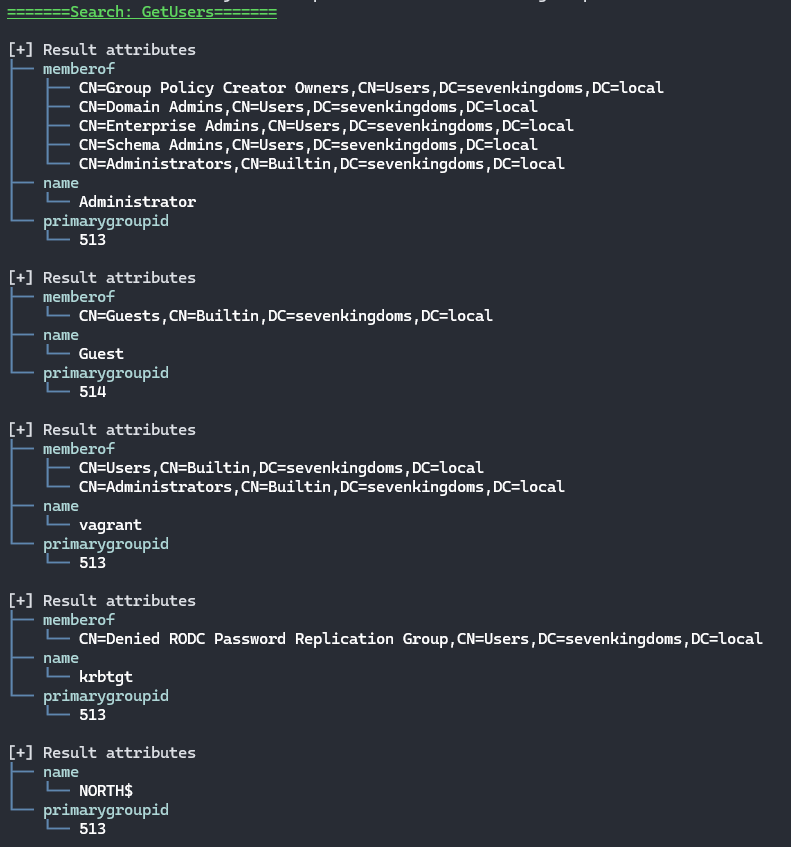
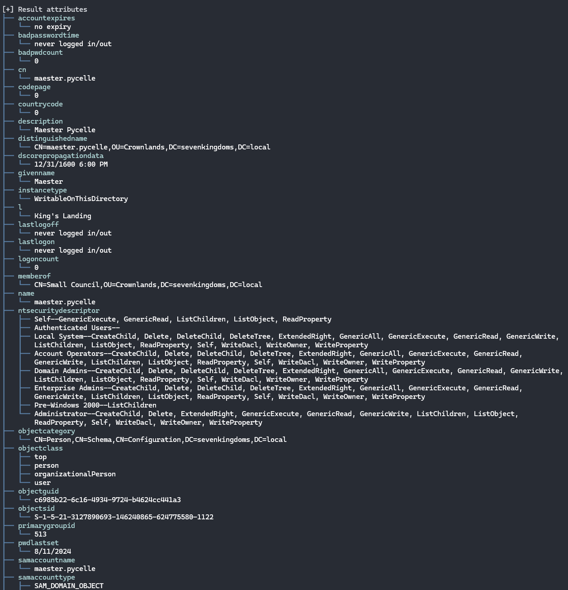
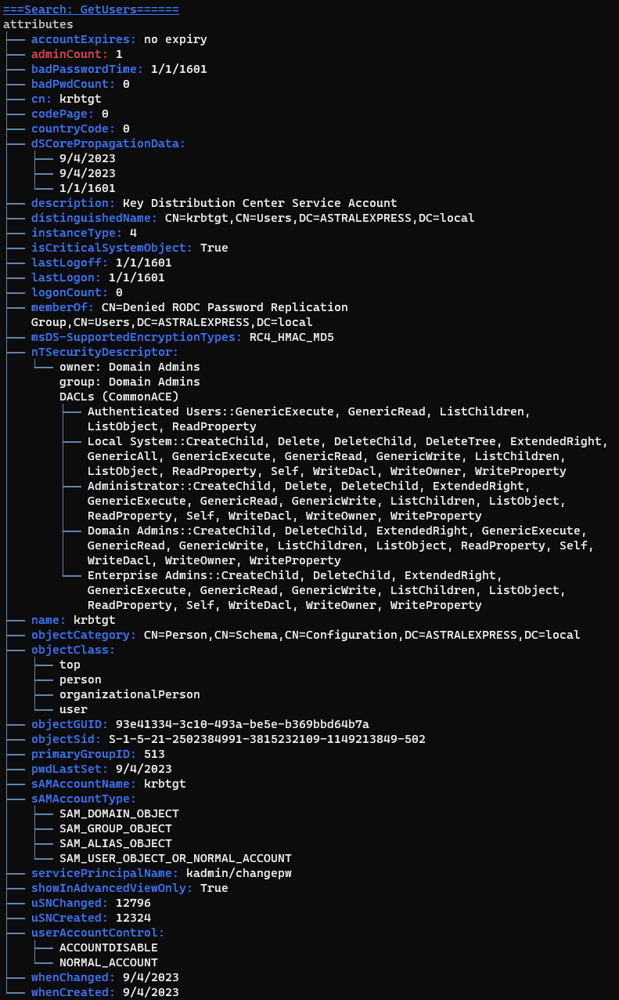

This is Fiewport, an **F**# Power**View** **port**.

(Yes, the name is silly.)

Fiewport is a library intended for use inside .fsx files. It provides a set of primitives for enumerating information from Microsoft Active Directory environments.

It includes useful filtering and manipulation functionality to quickly find the information pertinent to your investigation.

Eventually. It's not done yet. But here's what we have so far.

### Scripts

Fiewport is primarily intended to be used from inside F# script files (.fsx). The reason comes from Fiewport's roots. 

PowerShell is the source of most AD tooling for security professionals, not least of which is the titular PowerView. Part of the appeal of PowerView is that by leveraging the shell, commands can be piped into one another to sort and manipulate results.

I wanted to directly support that flexibility. And nothing pipes better than F#. (Fight me.)

Fiewport can be used as a normal library in a compiled application of course. I might even provide such a front end at some point. But the freedom of `fsi` allows a tester to quickly iterate on what they find important.

Fiewport ships with a script that's intended to be `#load`-ed into your actual script.

A short demonstration of Fiewport might look like this:

```fsharp
#load "ImportFiewport.fsx"

open Fiewport // mandatory
open System.DirectoryServices // mandatory

let config = 
    { properties = [||]
      filter = ""
      scope = SearchScope.Subtree
      ldapDomain = "LDAP://astralexpress.local"
      username = "trailblazer"
      password = "himekoscoffeeisthebest" }

[config]
|> Searcher.getUsers
|> PrettyPrinter.prettyPrint
```
As it suggests, this will create a connection to an active directory located at `LDAP://astralexpress.local` with the provided credentials. Fiewport does not assume your computer is connected to the AD you want to examine. Thus, this connection information is necessary. It also allows you to control what user(s) you chose to enumerate with.

The config is also where you may influence the LDAP filter used during the canned searches. Please read the comments on each `Seacher` method, because filters are sometimes `OR`-ed, sometimes `AND`ed, and sometimes ignored completely.

> ℹ️ If you want complete control over your search, see `Searcher.getDomainObjects`

Additionally, putting attributes into the `properties` array allows you to trim down the attributes that come back from a search. If you know you only care about, say, "adminCount" and the "userAccountControl" attributes, you can place them in the array and dramatically reduce the amount of console output. You can also create arrays of attributes ahead of time and keep them in your scripts.

For example, if you know you only cared about "name" "memberOf" and "primaryGroupID" for the `getUsers` search:

```fsharp
#load "ImportFiewport.fsx"

open Fiewport // mandatory
open System.DirectoryServices // mandatory

let config = 
    { properties = [|"name"; "memberOf"; "primaryGroupID"|]
      filter = ""
      scope = SearchScope.Subtree
      ldapDomain = "LDAP://astralexpress.local"
      username = "trailblazer"
      password = "himekoscoffeeisthebest" }

[config]
|> Searcher.getUsers
|> PrettyPrinter.prettyPrint
```



> ⚠️ Be careful when restricting LDAP searchers to certain properties! If you combine restricted properties with `Filter`s, and you try to filter for a property that isn't present, you'll just get empty results!

Since connection `config`s aren't global, you can store multiple configs with different LDAP addresses, users, etc. Put them all in a list, and feed them in!

This `Searcher` performs a built-in search to get users from the AD. The result of that search is an F# `List`. That list is then provided to the printer for displaying on the terminal.

A typical individual user result from the search might look like this:  



The top line indicates the source of the search. If you specified something in the filter configuration, it will be represented here as well.

In addition to the `Searcher` and the `PrettyPrinter`, Fiewport exposes `Filter`s, `Mold`s and `Tee`s

### Filter

The `Filter` has a few static methods that will come in handy when you want to...well...filter the results of your search. Rather than specifying very distinct queries using `-SearchBase` and such as in PowerView, the `Filter` allows easier and more iteration-friendly workflows.

Expanding our previous example:

```fsharp
#load "ImportFiewport.fsx"

open Fiewport
open System.DirectoryServices
let config = 
    { properties = [||]
      filter = ""
      scope = SearchScope.Subtree
      ldapDomain = "LDAP://astralexpress.local"
      username = "trailblazer"
      password = "himekoscoffeeisthebest" }

[config]
|> Searcher.getUsers
|> Filter.attributePresent "adminCount"
|> PrettyPrinter.prettyPrint
```


This `Filter` reduced 27 results down to just 3 for this AD.

We can chain it together with another `Filter` that requires an attribute to have a specific value:

```fsharp
#load "ImportFiewport.fsx"

open Fiewport
open System.DirectoryServices
let config = 
    { properties = [||]
      filter = ""
      scope = SearchScope.Subtree
      ldapDomain = "LDAP://astralexpress.local"
      username = "trailblazer"
      password = "himekoscoffeeisthebest" }

[config]
|> Searcher.getUsers
|> Filter.attributePresent "adminCount"
|> Filter.attributeIsValue "cn" ("Administrator" |> ADString)
|> PrettyPrinter.prettyPrint
```
This reduces the results to one.

As you can see from the `ADString` type in the second filter, Fiewport has its own abstractions over the datatypes that come back from LDAP queries. Most of the time you won't have to worry about them, but sometimes getting the right behavior requires specifying what type of data you're looking for.

Fiewport knows about the following Types

```
ADInt64
ADInt 
ADBool 
ADBytes 
ADString 
ADDateTime 
ADStringList
ADDateTimeList
ADBytesList 
```
You can use `thing |> type` syntax, or the (worse 😜) `(Type thing)` version.

### Molds

`Mold` is for when you want to get directly at a value from your search results. If your script has some very specific goals and you need direct access to data, `Mold` is what you want.

```fsharp
#load "ImportFiewport.fsx"

open Fiewport
open System.DirectoryServices
let config = 
    { properties = [||]
      filter = ""
      scope = SearchScope.Subtree
      ldapDomain = "LDAP://astralexpress.local"
      username = "trailblazer"
      password = "himekoscoffeeisthebest" }

[config]
|> Searcher.getUsers
|> Filter.attributePresent "memberOf"
|> Filter.attributeIsValue "cn" ("Administrator" |> ADString)
|> Mold.getValues "memberOf"
|> List.collect ADData.unwrapADStrings
|> List.iter sideEffectfulAction
```

Keep in mind that `Mold` expects you to know what you're doing. If, for example, you used `Mold.getValues` as above, but _hadn't_ used the `Filter` first to include only the results that had the `memberOf` attribute, you'll get a tidy crash!

### Tee

`Tee`s are for when you want to do multiple compound actions for one individual search. Keeping the literal number of searches to a minimum is usually beneficial to keeping a low profile on the network, as well as reducing load on domain controllers.

While you can certainly chain `Filter`s together, what you get at the end is a reduced set of results. Sometimes that's what you want, and othertimes not so much.

`Tee` lets you do something like this:

```fsharp
#load "ImportFiewport.fsx"

open Fiewport
open System.DirectoryServices
let config = 
    { properties = [||]
      filter = ""
      scope = SearchScope.Subtree
      ldapDomain = "LDAP://astralexpress.local"
      username = "trailblazer"
      password = "himekoscoffeeisthebest" }

[config]
|> Searcher.getUsers
|> Tee.filter (Filter.attributePresent "memberOf" >> Filter.attributeIsValue "cn" ("Administrator" |> ADString)) PrettyPrinter.prettyAction
|> Tee.filter (Filter.attributePresent "isCriticalSystemObject" >> Filter.attributeIsValue "primaryGroupID" (513 |> ADInt)) PrettyPrinter.prettyAction
|> ignore
```

`Tee.filter` has a function signature of `Filter -> FilterAction -> LDAPSearchResult list -> LDAPSearchResult list`. This allows you to use the composition `>>` operator to build a `Filter` chain, and then cap the function off with the so-called `FilterAction`.

Chain `Tee`s together to do more than one thing with a single search. Out the 'end' of the `Tee` comes the same search results that went in. You can throw them away, as in the example above, or do whatever else you like.

> Right now, the only `FilterAction` is the one provided by `PrettyPrint` but file writes are on the roadmap. Feel free to write something yourself in the meantime. `FilterAction` is just `LDAPSearchResult -> unit`

### Self

`Self` is underdeveloped right now, but will provide some .Net-native introspection for when your machine is itself attached to an AD. More here later.

### PrettyPrinter

Does what it says on the tin. Emits all the AD attributes I've been able to encounter during development in a way that is (hopefully) clearer than just giant blobs of text. Instead we have _colored_ blobs of text!


### Shortcomings

~~* Schema: Fiewport stores all 1507 MS-native AD attributes. However, it is very common for 3rd party software and sysadmins to add custom attributes. Supporting these cleanly means doing some inspection of the schema, and I haven't worked with that yet. It's a planned feature. Until then, those attributes will not show up on their objects.~~ Fixed!
* Negation filters: `Filter` has no negations built-in. Planned.
* Automatic GPO resolution: GPOs are tracked by their GUID. PowerView and others resolve these to human-names automatically (more or less). Planned.
* Forced color: `PrettyPrinter` enforces color, which isn't completely compatible or always desirable. I'll provide a no-color option around the time that file export is added.
* No file operations: Speaking of file export, there isn't any. Of course, these are .fsx files and `System.IO` is an import away. Planned.
* No caching controls: The underlying LDAP searcher supports caching results. However, the way Fiewport disposes of searchers means this setting isn't relevant. I think the use of `Tee`s allows for most of the benefits of caching. 
* nuget: No nuget package yet. Planned once churn is way down.
* Feature-parity with Powerview: Likely will never happen. Powerview includes 'offensive' capabilities, but Fiewport is intended to be purely idempotent and safe to run. For the rest, between configs and `Filter`, there shouldn't be anything major that Powerview can do that Fiewport can't.

### Acknowledgements

Obviously, Fiewport is a derivative of PowerView, at least in spirit. I can't really read Powershell very well, honestly, so the only actual 'code' that came from Powerview was just some function/method names. Still, it provided a usability blueprint that I've endeavored to follow closely.

So thanks to @harmj0y for doing the work originally, and many others who have forked and adapted it going forward.

### Code of Conduct

I rule with an iron fist. I reject CoCs.