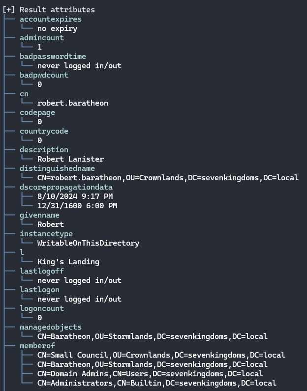

This is Fiewport, an **F**# Power**View** **port**.

(Yes, the name is silly.)

Fiewport is a library intended for assisting pentesters with enumerating and manipulating information from Microsoft Active Directory environments.

> ⚠️ Fiewport currently runs only on Windows hosts, due to limitations in Microsoft's support of LDAP authentication mechanisms on other platforms

### Scripts

Fiewport is intended to be used from inside F# script files (.fsx). The reason comes from Fiewport's roots. 

Much Active Directory tooling comes from PowerShell, not least of which is the titular PowerView. Part of the appeal of PowerView is that by leveraging the shell, commands can be piped into one another to sort and manipulate results.

I wanted to directly support that flexibility, and nothing pipes better than F#. (Fight me.)

### Configuration

A short demonstration of Fiewport in a script might look like this:

```fsharp
#r "nuget: Fiewport"
#r "nuget: System.DirectoryServices.Protocols"
#r "nuget: EluciusFTW.SpectreCoff"
#r "nuget: MessagePack"

open Fiewport
open System.DirectoryServices.Protocols

let config =
    { properties = [||]
      filter = ""
      ldapDN = "DC=sevenkingdoms,DC=local"
      scope = SearchScope.Subtree
      ldapHost = "192.168.56.10" 
      username = "samwell.tarly"
      password = "Heartsbane" }
    

[config]
|> Searcher.getUsers
|> PrettyPrinter.print
```
As it suggests, this will create a connection to an active directory located at `northernkingdoms.local` with the provided credentials. Fiewport does not assume your computer is connected to the AD you want to examine, so this information is necessary. It also allows you to control what user(s) you chose to enumerate with.

The `config.filter` is where you may influence the LDAP filter used during the canned searches. Please read the comments on each `Seacher` method, because filters are sometimes `OR`-ed, sometimes `AND`ed, and sometimes ignored completely.

> ℹ️ If you want complete control over your search, see `Searcher.getDomainObjects`

Additionally, putting attributes into the `properties` array allows you to trim down the attributes that come back from a search. If you know you only care about, say, "adminCount" and the "userAccountControl" attributes, you can place them in the array and dramatically reduce the amount of console output. You can also create arrays of attributes ahead of time and keep them in your scripts.

For example, if you know you only cared about "name" "memberOf" and "primaryGroupID" for the `getUsers` search:

```fsharp
#r "nuget: Fiewport"
#r "nuget: System.DirectoryServices.Protocols"
#r "nuget: EluciusFTW.SpectreCoff"
#r "nuget: MessagePack"

open Fiewport
open System.DirectoryServices.Protocols

let config = 
    { properties = [|"name"; "memberOf"; "primaryGroupID"|]
      filter = ""
      scope = SearchScope.Subtree
      ldapDN = "DC=northernkingdoms,DC=local"
      ldapHost = "192.168.56.10"
      username = "samwell.tarly"
      password = "Heartsbane" }

[config]
|> Searcher.getUsers
|> PrettyPrinter.prettyPrint
```


> ⚠️ Be careful when restricting LDAP searchers to certain properties! If you combine restricted properties with a `Filter` and you try to filter for a property that isn't present, you'll just get empty results!

Since connection `config`s aren't global, you can store multiple configs with different LDAP addresses, users, etc. Put them all in a list, and feed them in!

### Searchers

Fiewport exposes a `Searcher` with many pre-built LDAP queries built into it. Your IDE of choice should expose all of them to you, and all of them have some documentation of what filter they are using. `Searcher.getUsers` performs a search to get users from the AD, for example.

All Searchers yield a `List`. The list can then be used in a variety of ways, explained below.

A typical individual user result from the search might look like this:


The current built-in searchers are:
```fsharp
getUsers
getComputers
getSites
getOUs
getGroups
getDomainDNSZones
getDNSRecords
getDomainSubnets
getDFSShares
getGroupPolicyObjects
getDomainTrusts
getDomainObjects
getDomainControllers
getHostsTrustedForDelegation
getReportedServersNotDC
getContainers
getUsersWithSPNs
getConstrainedDelegates
getASREPTargets
getKerberoastTargets
getProtectedUsers
getGroupsWithLocalAdminRights
dumpAD

```

In addition to the `Searcher`, Fiewport exposes `Filter`s, `Mold`s `Tee`s and a `Serialize` function.

### Filter

The `Filter` has a few static methods that will come in handy when you want to...well...filter the results of your search. Rather than specifying very distinct queries using `-SearchBase` and such as in PowerView, the `Filter` allows easier and more iteration-friendly workflows.

Expanding our previous example:

```fsharp
#r "nuget: Fiewport"
#r "nuget: System.DirectoryServices.Protocols"
#r "nuget: EluciusFTW.SpectreCoff"
#r "nuget: MessagePack"

open Fiewport
open System.DirectoryServices.Protocols

let config = 
    { properties = [||]
      filter = ""
      scope = SearchScope.Subtree
      ldapDN = "DC=northernkingdoms,DC=local"
      ldapHost = "192.168.56.10"
      username = "samwell.tarly"
      password = "Heartsbane" }

[config]
|> Searcher.getUsers
|> Filter.attributePresent "adminCount"
|> PrettyPrinter.prettyPrint
```


This `Filter` reduced results down to just 5 for this AD.

We can chain it together with another `Filter` that requires an attribute to have a specific value:

```fsharp
#r "nuget: Fiewport"
#r "nuget: System.DirectoryServices.Protocols"
#r "nuget: EluciusFTW.SpectreCoff"
#r "nuget: MessagePack"

open Fiewport
open System.DirectoryServices.Protocols

let config = 
    { properties = [||]
      filter = ""
      scope = SearchScope.Subtree
      ldapDN = "DC=northernkingdoms,DC=local"
      ldapHost = "192.168.56.10"
      username = "samwell.tarly"
      password = "Heartsbane" }

[config]
|> Searcher.getUsers
|> Filter.attributePresent "adminCount"
|> Filter.attributeIsValue "cn" "Administrator"
|> PrettyPrinter.prettyPrint
```
This reduces the results to one.

### Molds

`Mold` is for when you want to get directly at a value from your search results. If your script has some very specific goals and you need direct access to data, `Mold` is what you want.

```fsharp
#r "nuget: Fiewport"
#r "nuget: System.DirectoryServices.Protocols"
#r "nuget: EluciusFTW.SpectreCoff"
#r "nuget: MessagePack"

open Fiewport
open System.DirectoryServices.Protocols

let config = 
    { properties = [||]
      filter = ""
      scope = SearchScope.Subtree
      ldapDN = "DC=northernkingdoms,DC=local"
      ldapHost = "192.168.56.10"
      username = "samwell.tarly"
      password = "Heartsbane" }

[config]
|> Searcher.getUsers
|> Filter.attributePresent "memberOf"
|> Filter.attributeIsValue "cn" "Administrator"
|> Mold.getValues // string list list list
|> doWhateverYouLikeWithYourResults
```

### Tee

`Tee`s are for when you want to perform compound actions for one individual search. 

While you can certainly chain `Filter`s together, what you get at the end is a reduced set of results. Sometimes that's what you want, but probably not always.

`Tee` lets you do something like this:

```fsharp
#r "nuget: Fiewport"
#r "nuget: System.DirectoryServices.Protocols"
#r "nuget: EluciusFTW.SpectreCoff"
#r "nuget: MessagePack"

open Fiewport
open System.DirectoryServices.Protocols

let config = 
    { properties = [||]
      filter = ""
      scope = SearchScope.Subtree
      ldapDN = "DC=northernkingdoms,DC=local"
      ldapHost = "192.168.56.10"
      username = "samwell.tarly"
      password = "Heartsbane" }

[config]
|> Searcher.getUsers
|> Tee.filter (Filter.attributePresent "memberOf" >> Filter.attributeIsValue "cn" "Administrator") PrettyPrinter.teePrint
|> Tee.filter (Filter.attributePresent "isCriticalSystemObject" >> Filter.attributeIsValue "primaryGroupID" "513") PrettyPrinter.teePrint
|> ignore
```

`Tee.filter` has a function signature of `Filter -> FilterAction -> LDAPSearchResult list -> LDAPSearchResult list`. This allows you to compose a `Filter` chain, and then cap the function off with the so-called `FilterAction`.

Chain `Tee`s together to do more than one thing with a single search. Out the 'bottom' of the `Tee` comes the same search results that went in. You can throw them away, as in the example above, or do whatever else you like.

> Right now, the only `FilterAction` is the one provided by `PrettyPrint`. A `FilterAction` is just `LDAPSearchResult list -> unit`

### PrettyPrinter

Does what it says on the tin. Formats data into something that is a bit more readable. 


### Serializer

Fiewport now supports serializing and deserializing LDAP search results to/from disk using MessagePack with compression, making it quite small. For reference, the `dumpAD` call run against the smaller Game of Active Directory environment yielded a 56KB file.

```#r "nuget: Fiewport"
#r "nuget: System.DirectoryServices.Protocols"
#r "nuget: EluciusFTW.SpectreCoff"
#r "nuget: MessagePack"

open Fiewport
open System.DirectoryServices.Protocols

let config =
{ properties = [||]
filter = ""
scope = SearchScope.Subtree
ldapDN = "DC=northernkingdoms,DC=local"
ldapHost = "192.168.56.10"
username = "samwell.tarly"
password = "Heartsbane" }

[config]
|> Searcher.getUsers
|> Serializer.serializeToDisk // writes "DC=sevenkingdoms,DC=local-GetUsers-lcache.bin"
|> ignore
```

Fiewport will write a .bin file to the current working directory, named by the type of search you performed and the DN of the directory you queried. 

Additionally, the `Serializer` will return the results list, so more processing can be done afterwards. 

To use the bin file, simply replace the beginning of the pipeline with the deserialize call:

```
Serializer.deserializeFromDisk """C:\path\to\bin\DC=sevenkingdoms,DC=local-GetUsers-lcache.bin"""
|> Filter.valueIs "robb.stark"
|>PrettyPrinter.print
```


### Shortcomings

* ~~Schema: Fiewport stores all 1507 MS-native AD attributes. However, it is very common for 3rd party software and sysadmins to add custom attributes. Supporting these cleanly means doing some inspection of the schema, and I haven't worked with that yet. It's a planned feature. Until then, those attributes will not show up on their objects.~~ Fixed!
* Negation filters: `Filter` has no negations built-in. Planned.
* Automatic GPO resolution: GPOs are tracked by their GUID. PowerView and others resolve these to human-names automatically (more or less). Planned.
* Forced color: `PrettyPrinter` enforces color, which isn't completely compatible or always desirable. I'll provide a no-color option around the time that file export is added.
* ~~No file operations: Speaking of file export, there isn't any. Of course, these are .fsx files and `System.IO` is an import away. Planned.~~ Covered by serialization above.
* ~~No caching controls: The underlying LDAP searcher supports caching results. However, the way Fiewport disposes of searchers means this setting isn't relevant. I think the use of `Tee`s allows for most of the benefits of caching.~~ Moving to `S.DS.P` removed this optionality, but the addition of serializing the results covers it. 
* ~~nuget: No nuget package yet. Planned once churn is way down.~~ Live at nuget.org
* Feature-parity with Powerview: Likely will never happen. Powerview includes 'offensive' capabilities, but Fiewport is intended to be purely idempotent and safe to run. For the rest, between configs and `Filter`, there shouldn't be anything major that Powerview can do that Fiewport can't.

### Acknowledgements

Obviously, Fiewport is a derivative of PowerView, at least in spirit. I can't really read Powershell very well, honestly, so the only actual 'code' that came from Powerview was just some function/method names. Still, it provided a usability blueprint that I've endeavored to follow closely.

So thanks to @harmj0y for doing the work originally, and many others who have forked and adapted it going forward.

### Code of Conduct

I rule with an iron fist. I reject CoCs.